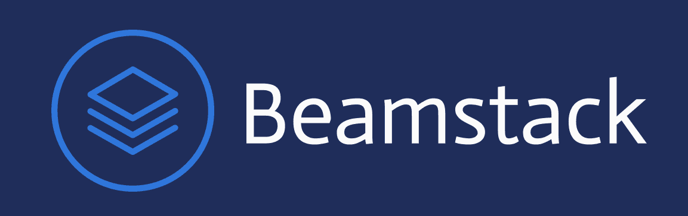
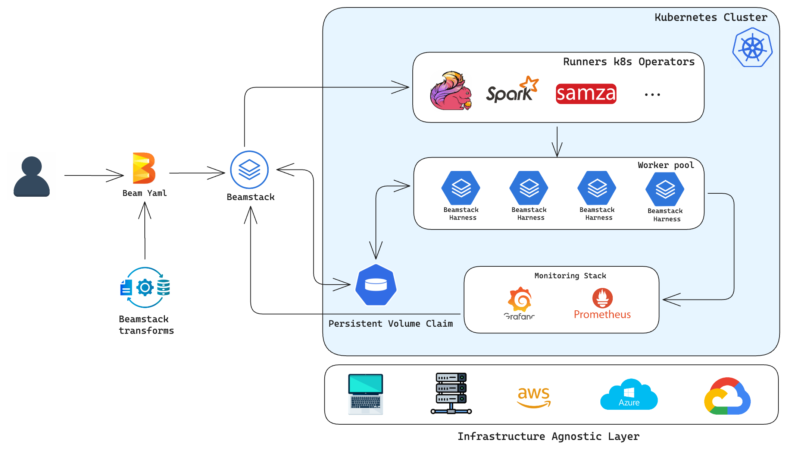
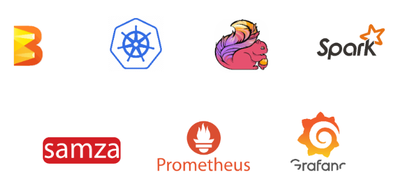

<p align="center">
  <picture>
    <source srcset="./assets/beamstack-logo-all.png">
    
  </picture>
  <h1 align="center" style="font-size: 24px;">Kubernetes Framework for deploying ML and GenAI Apache Beam workflows</h1>
</p>  

<p> </p>

<p align="center">
  <br>
  <a href="https://beamstackproj.github.io/website/docs/" rel="nofollow"><strong>Explore Beamstack Documentation »</strong></a>
  <br>
  <a href="https://beamstackproj.github.io/website/docs/about/community/"><strong>Join Beamstack Community »</strong></a>
  <br>
  <a href="https://beamstackproj.github.io/website/blog/"><strong>Explore Blogs »</strong></a>
  <br>
  <a href="https://discord.gg/fYNnNVaEFK"><strong>Join Discord Channel</strong></a>
</p>

</p>
<p align="center">
<a href="https://discord.gg/fYNnNVaEFK"></a>
<a href="http://golang.org"></a>

## **Beamstack Features**

<details>
  <summary><b>Simplified ML Workflow Deployment:</b></summary>
  <ul>
    <li>Beamstack simplifies the deployment of machine learning workflows on Kubernetes.</li>
  </ul>
</details>

<details>
  <summary><b>Holistic Solution:</b></summary>
  <ul>
    <li>Beamstack offers an all-encompassing solution for managing machine learning pipelines, data processing workflows, and deployment infrastructure.</li>
  </ul>
</details>

<details>
  <summary><b>Abstraction Layers:</b></summary>
  <ul>
    <li>Beamstack introduces abstraction layers that streamline the deployment of Apache Beam Pipelines in Kubernetes.</li>
  </ul>
</details>

<details>
  <summary><b>Leveraged Kubernetes Custom Resource Definitions (CRDs):</b></summary>
  <ul>
    <li>Beamstack uses Kubernetes CRDs to extend the Kubernetes API, allowing smooth integration of machine learning-specific resources.</li>
  </ul>
</details>

<details>
  <summary><b>Seamless Provisioning of Spark and Flink Clusters in Kubernetes:</b></summary>
  <ul>
    <li>Beamstack incorporates features that spin up spark and flink clusters in Kubernetes for running Apache Beam Jobs</li>
  </ul>
</details>

<details>
  <summary><b>Easily Monitor and Visualize Deployed Workflows:</b></summary>
  <ul>
    <li>Beamstack seamlessly integrates with Prometheus and Grafana to visualize the states of the deployed workflows in real time.</li>
  </ul>
</details>  
  
---  

## **Architecture** 
<p align="center"></p>
  
--- 

## **Installation**  

### 1. Prerequisite
To be able to work with beamstack-cli, an active Kubernetes cluster is required. Before you begin 
setup a local Kubernetes cluster using [minikube](https://minikube.sigs.k8s.io/docs/start)

### 2. Start Kubernetes cluster:  
```bash
minikube delete && minikube start \
    --kubernetes-version=v1.23.0 \
    --memory=6g --bootstrapper=kubeadm \
    --extra-config=kubelet.authentication-token-webhook=true \
    --extra-config=kubelet.authorization-mode=Webhook \
    --extra-config=scheduler.bind-address=0.0.0.0 \
    --extra-config=controller-manager.bind-address=0.0.0.0
``` 

### 3. download the helper scrip:
   
```bash
wget https://raw.githubusercontent.com/BeamStackProj/beamstack-cli/main/get-beamstack.sh
```  

### 4. Install beamstack-cli:
  
```bash
sh get-beamstack.sh
```

---

### 5. Verify beamstack installation:  
  
```bash
beamstack
```

---

## **Initializing your kubernetes cluster** 

To configure your Kubernetes cluster for running Beam YAML pipelines and accessing other BeamStack commands, use the `init` command in BeamStack.

- Step 1: View Available Flags
Start by viewing the available flags and options for the init command:

```bash
beamstack init --help
```

 - Step 2: Initialize BeamStack with Your Desired Configuration
Once you've reviewed the options, initialize BeamStack with the configuration that suits your needs:

```bash
beamstack init -me
```
---


## **Components of Beamstack** 

- Beamstack CLI
- Beamstack Custom Transforms
- Apache Beam YAML 
- Kubernetes
- Monitoring

---

## **Beamstack Technology**  

<p align="center"></p>

---

## :muscle: **Support, Contribution, and Community**
 
### :busts_in_silhouette: Community
 
Get updates on Beamstack's development and chat with project maintainers, contributors, and community members  
- Visit the [Community Page](https://beamstackproj.github.io/website/docs/about/community/)
- Raise feature requests, suggest enhancements, and report bugs in our [GitHub Issues](https://github.com/BeamStackProj/beamstack-cli/issues)
- Articles, How-Tos, Tutorials - [Beamstack Blogs](https://beamstackproj.github.io/website/blog/)

### :handshake: Contribute
 
Take a look at our [contributing guidelines](https://beamstackproj.github.io/website/docs/about/contributing/) for information on how to open issues, adhere to coding standards, and understand our development processes. We greatly value your contribution.